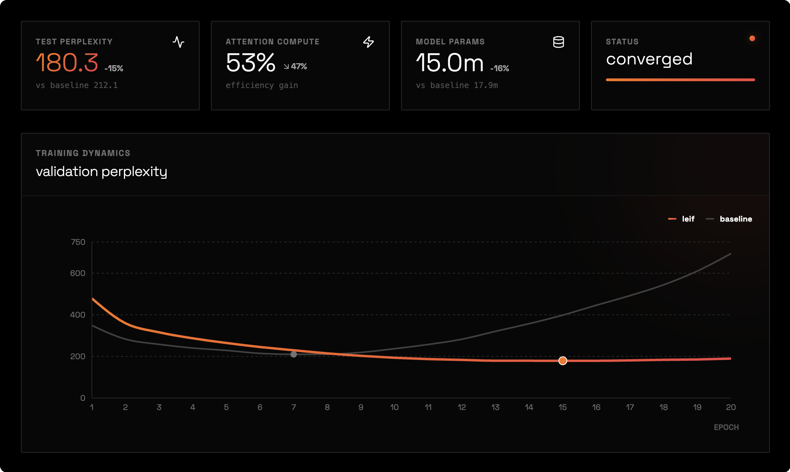
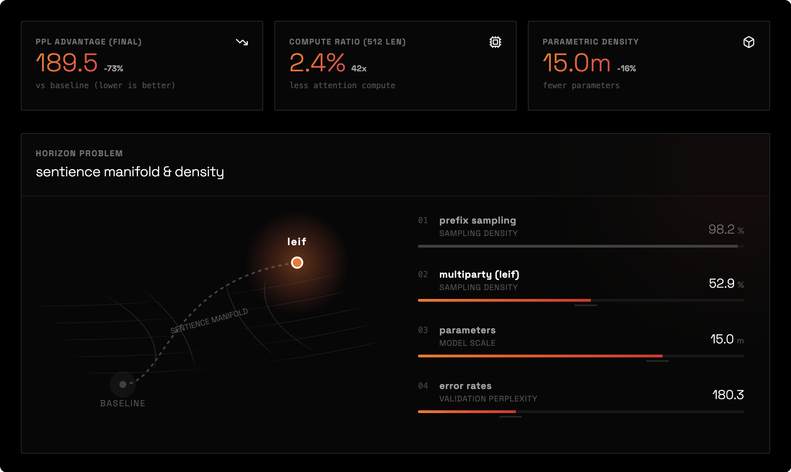
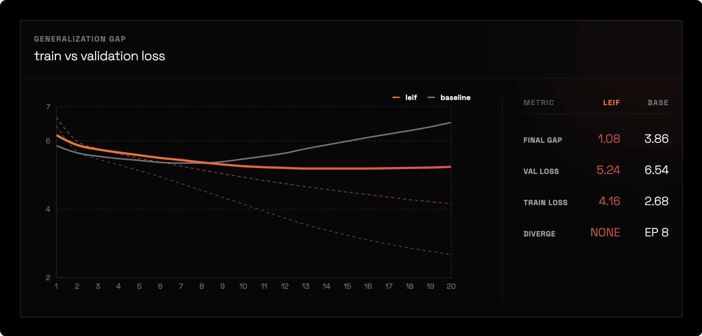

# leif


**graph-structured attention for lexia-native language modeling**

leif treats conversations as graphs of participation events (lexia) rather than flat token sequences. by encoding relational structure directly into the attention mask, leif achieves better perplexity with less compute—and doesn't overfit like dense transformers.

---

## results



| model | perplexity | attention density | parameters |
|-------|------------|-------------------|------------|
| baseline transformer | 212.1 | 100% | 17.9m |
| **leif** | **180.3** | **53%** | 15.0m |

### generalization gap



baseline overfits catastrophically — train/val gap explodes to 3.86 by epoch 20. leif maintains a tight gap of 1.08 throughout training. the relational structure prevents memorization and forces actual learning.

### the conversation horizon problem



we discovered that standard prefix sampling of multi-party datasets systematically erases relational structure:
- ubuntu conversations are labeled as "8-14 agents"
- but the first n tokens are almost always 2-agent exchanges
- multi-party activity happens in the middle of conversations

our fix: **multiparty sampling** — select windows with maximum agent diversity. this dropped attention density from 98% to 53%, finally exposing the topology leif was designed for.

---

## the core idea

standard transformers see text as a sequence of tokens:
```
["alice:", "hello", "bob:", "hi", "alice:", "how", "are", "you"]
```

leif sees text as a graph of lexia (participation events):
```
lexia 1: alice → bob, "hello"
lexia 2: bob → alice, "hi"  
lexia 3: alice → bob, "how are you"
```

the **lexical mask** encodes this graph structure directly into attention:
- each position only attends to relationally relevant positions
- same sender (what did i say before?)
- direct address (who is talking to me?)
- temporal neighbors (what just happened?)

this is not learned sparsity. the mask is **derived deterministically from the data**.

---

## installation

```bash
git clone https://github.com/beerooyay/leif.git
cd leif
pip install -r requirements.txt
```

## quick start

```python
from leif import LeifModel, LexiaDataset, build_lexical_mask

# load data
dataset = LexiaDataset.load("data/ubuntu_multiparty")

# build model
model = LeifModel(
    vocab_size=25000,
    d_model=256,
    n_heads=4,
    n_layers=6,
    max_seq_len=512
)

# train
python -m leif.train --data data/ubuntu_multiparty --epochs 20
```

## reproduce paper results

```bash
# parse ubuntu dialogue corpus with multiparty sampling
python -m leif.ubuntu_real --max_conversations 5000

# train baseline
python -m leif.train --model baseline --data data/ubuntu_multiparty \
    --epochs 20 --batch_size 16 --max_seq_len 512

# train leif
python -m leif.train --model leif --data data/ubuntu_multiparty \
    --epochs 20 --batch_size 16 --max_seq_len 512
```

---

## paper

**lexical information physics: from tokens to participation events**

> [**read the full paper (pdf)**](docs/lip.pdf) | [view source (latex)](docs/lip.tex)

### key contributions

1. **lexia as primitive**: language events are tuples (sender, receiver, conduit, time, token), not bare tokens

2. **marginalization cost theorem**: token models are projections of lexia models and pay an information penalty bounded by conditional mutual information

3. **graph-structured attention**: the lexical mask induces a markov blanket that screens off irrelevant context

4. **empirical semantic mass**: per-lexia measure of how much relational structure improves prediction

## architecture

```
leif-nano
├── embedding layer
│   ├── token embedding (d=256)
│   ├── sender embedding (d=32)
│   ├── receiver embedding (d=32)
│   ├── conduit embedding (d=16)
│   └── time embedding (d=32)
├── projection to d_model=256
├── 6x transformer blocks with graph-structured attention
│   └── attention masked by lexical mask G
└── output head (vocab prediction)
```

## citation

```bibtex
@article{rouyea2025lip,
  title={lexical information physics: from tokens to participation events},
  author={rouyea, blaize},
  year={2025},
  note={available at https://github.com/beerooyay/leif}
}
```

## license

mit
