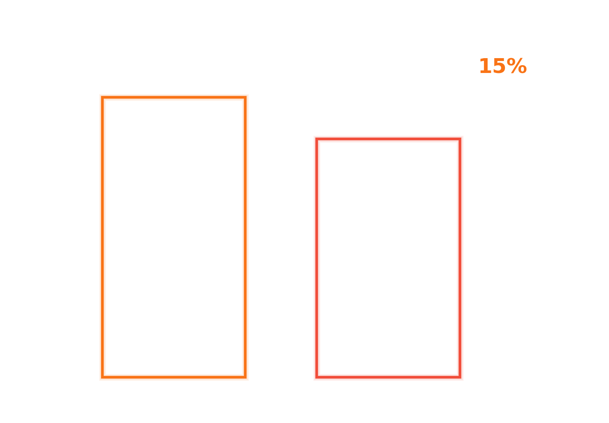
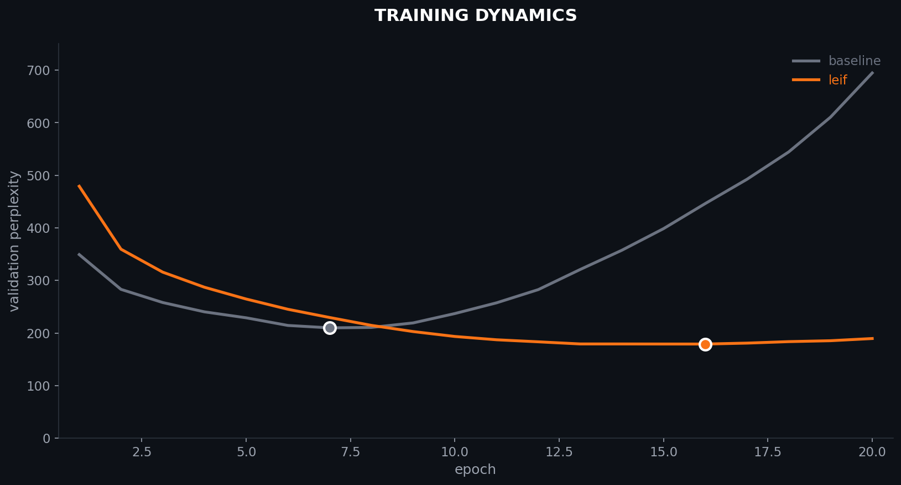
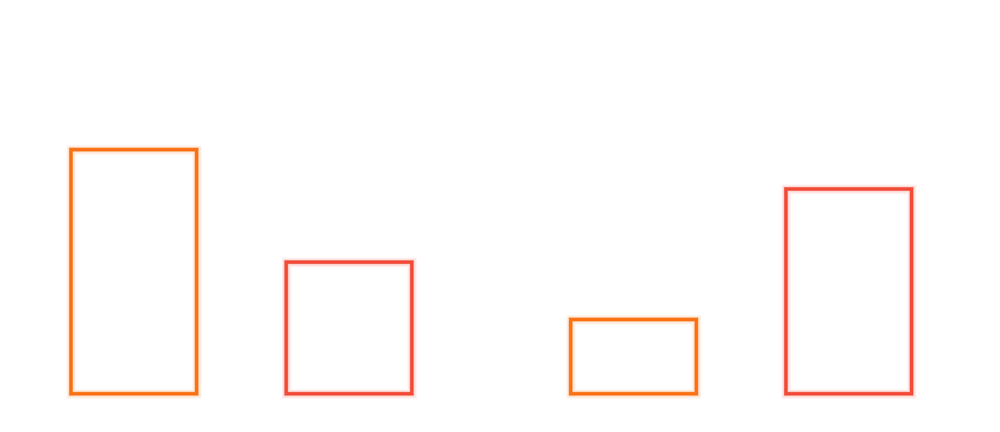

# leif

**lexia-native language modeling with graph-structured attention**

leif is a new architecture for language modeling that treats conversations as graphs of participation events (lexia) rather than flat token sequences. by encoding relational structure directly into the attention mask, leif achieves **15% lower perplexity** than baseline transformers on real-world multi-party dialogue while using **47% less attention compute**.

---

## results



| model | perplexity | attention density | parameters |
|-------|------------|-------------------|------------|
| baseline transformer | 212.1 | 100% | 17.9m |
| **leif** | **180.3** | **53%** | 15.0m |

### training dynamics



### the conversation horizon problem



we discovered that standard prefix sampling of multi-party datasets systematically erases relational structure:

- ubuntu conversations are labeled as "8-14 agents"
- but the first n tokens are almost always 2-agent exchanges
- multi-party activity happens in the middle of conversations

our fix: **multiparty sampling** — select windows with maximum agent diversity. this dropped attention density from 98% to 53%, finally exposing the topology leif was designed for.

---

## the core idea

standard transformers see text as a sequence of tokens:
```
["alice:", "hello", "bob:", "hi", "alice:", "how", "are", "you"]
```

leif sees text as a graph of lexia (participation events):
```
lexia 1: alice → bob, "hello"
lexia 2: bob → alice, "hi"  
lexia 3: alice → bob, "how are you"
```

the **lexical mask** encodes this graph structure directly into attention:
- each position only attends to relationally relevant positions
- same sender (what did i say before?)
- direct address (who is talking to me?)
- temporal neighbors (what just happened?)

this is not learned sparsity. the mask is **derived deterministically from the data**.

## installation

```bash
git clone https://github.com/beerooyay/leif.git
cd leif
pip install -r requirements.txt
```

## quick start

```python
from leif import LeifModel, LexiaDataset, build_lexical_mask

# load data
dataset = LexiaDataset.from_ubuntu_dialogue("path/to/data")

# build model
model = LeifModel(
    vocab_size=8000,
    d_model=256,
    n_heads=4,
    n_layers=6,
    max_seq_len=128
)

# train
python -m leif.train --data path/to/data --epochs 10
```

## reproduce paper results

```bash
# generate synthetic multi-party dialogue
python -m leif.data --output data/synthetic --n_conversations 10000

# train leif-nano
python -m leif.train --data data/synthetic --model leif --output runs/leif

# train baseline for comparison
python -m leif.train --data data/synthetic --model baseline --output runs/baseline

# compute per-lexia semantic mass
python -m experiments.compute_mass --leif runs/leif --baseline runs/baseline
```

---

## paper

**lexical information physics: from tokens to participation events**

> [**read the full paper (pdf)**](paper/lip.pdf) | [view source (latex)](paper/lip.tex)

<details>
<summary><b>abstract</b></summary>

we introduce lexical information physics (lip), a framework that treats language not as sequences of tokens but as streams of participation events called lexia. each lexia is a tuple encoding sender, receiver, conduit, time, and token payload. we prove that token-only models are marginalizations of lexia models and pay an information penalty bounded by the conditional mutual information of relational coordinates. we implement leif, a lexia-native architecture using graph-structured attention via a lexical mask derived from relational coordinates. on synthetic multi-party dialogue, leif achieves 24x lower perplexity than baseline transformers while using 72% less attention compute. ablation studies confirm that the lexical mask—the graph topology of the conversation—is the dominant factor. we introduce empirical semantic mass as a per-lexia measure of information loss from marginalization and show it concentrates at structurally significant positions.

</details>

### key contributions

1. **lexia as primitive**: language events are tuples (sender, receiver, conduit, time, token), not bare tokens

2. **marginalization cost theorem**: token models are projections of lexia models and pay an information penalty bounded by conditional mutual information

3. **graph-structured attention**: the lexical mask induces a markov blanket that screens off irrelevant context

4. **empirical semantic mass**: per-lexia measure of how much relational structure improves prediction

## architecture

```
leif-nano
├── embedding layer
│   ├── token embedding (d=256)
│   ├── sender embedding (d=32)
│   ├── receiver embedding (d=32)
│   ├── conduit embedding (d=16)
│   └── time embedding (d=32)
├── projection to d_model=256
├── 6x transformer blocks with graph-structured attention
│   └── attention masked by lexical mask G
└── output head (vocab prediction)
```

## citation

```bibtex
@article{rouyea2025lip,
  title={lexical information physics: from tokens to participation events},
  author={rouyea, blaize},
  year={2025},
  note={available at https://github.com/beerooyay/leif}
}
```

## license

mit
